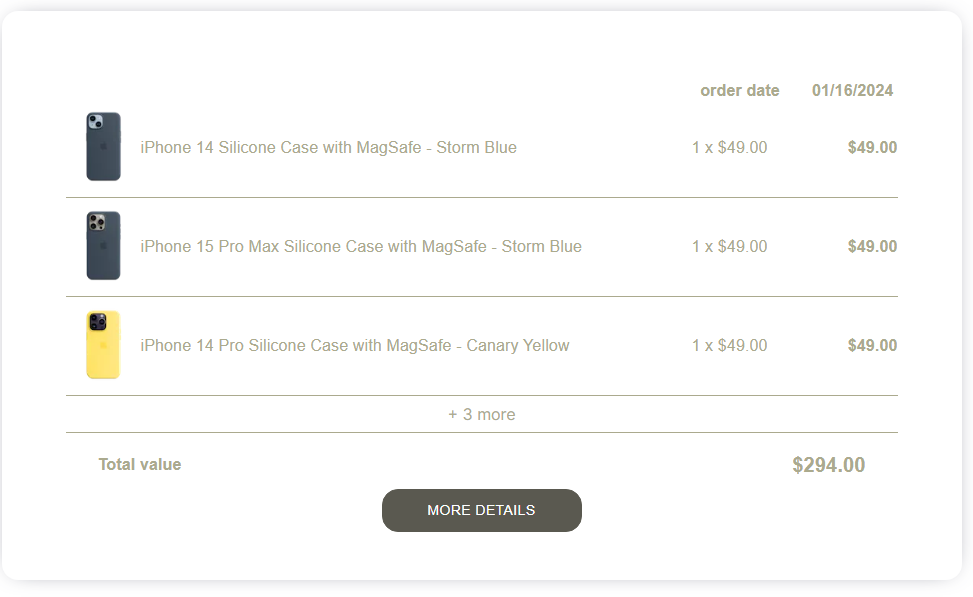

# PhoneGear

## Description

This is online shop focused on phone accesories, such as

- phone cases
- charging adapters
- phone cables

## Table of Contents

- [Installation](#installation)
- [Usage](#usage)
- [Features](#features)
- [Development](#development)

## Installation

Requirements:

- Node.js
- npm

To install project dependencies use

```
npm install
```

To run app use

```
npm run start
```

To build app use

```
npm run build
```

To test app use

```
npm test
```

## Usage

|                                               |                                                               |
| :-------------------------------------------: | :-----------------------------------------------------------: |
|    _1. Home page_     |         _2. Product list_          |
| _3. Product page_  | _4. Previous orders page_  |
|  _5. Basket page_   |          _6. Admin panel_           |

## Features

1. Home page
   - Home page contains short AI generated information about PhoneGear company.
2. Product list
   - Divided between three main categories: - Phone cases - Charging adapters - Cables
     In each main category user can select from all definied subcategories eg. Iphone 14, after selecting subcategory
     products are filtrated.
3. Product page
   - Product page contains product image, section with product name, quantity input and button. Under the product name section user can find product description section. At the bottom there is Similar products section, containing products from the same subcategory as currently selected product.
4. Previous orders page
   - Here user can check his previous orders, after clicking More details button user is redirected to Order page.
     Single order in list shows up to 3 products and than it shows info _+{x} more_
     <center></center>
5. Basket page
   - At the basket page user can increase/decrease quantity of selected products or delete product from basket.
     User can also select preffered payment and delivery method, after using Proceed button user is redirected to order page.
6. Admin panel
   - User can only get to this page by manualy adding /adminPanel to base URL
   - In admin panel user can add new products or new subcategories.

## Development

- Problems faced during coding

  - First major problem I encountered during PhoneGear development was just GitHub and errors with hosting Next.js page using router params.
  - After adding post requests creating new items I had to find a way to disable/reload cache - new items weren't showing up on lists.

- Potential further development
  - Other CRUD operations (Update, Delete) in Admin Panel.
  - Logging in functionality.
  - Promo codes.
